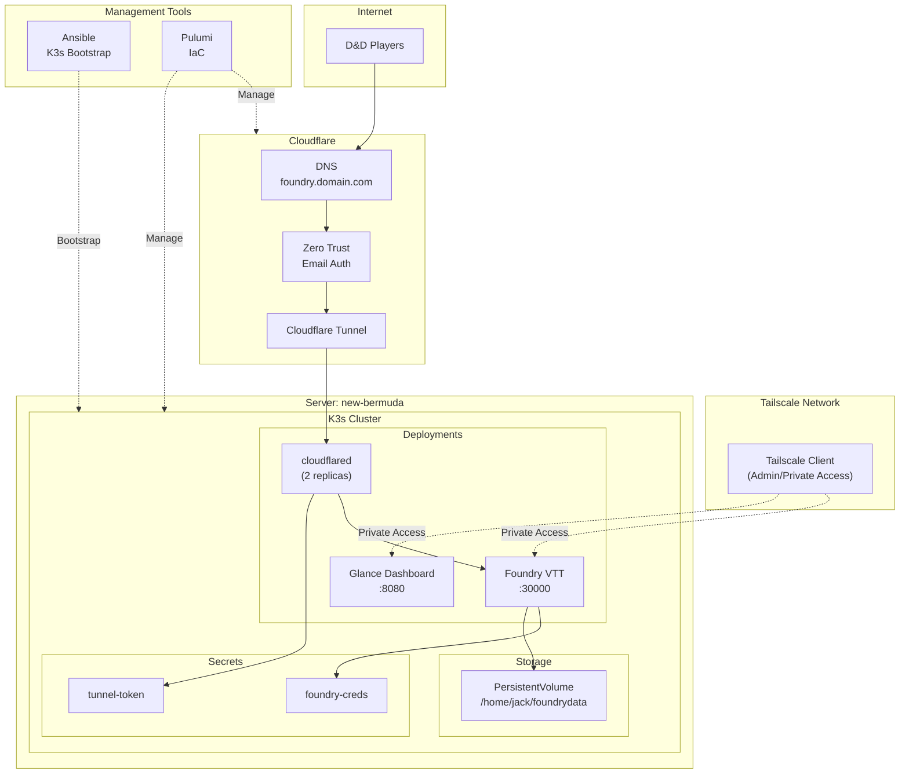

# Install & Setup Notes
## Ansible
- Seems to require `export ANSIBLE_BECOME_EXE=sudo.ws` due to [this issue](https://github.com/ansible/ansible/issues/85837)
- Run with `ansible-playbook playbook.yml -i inventory.yml -kK` where the flags have you manually input SSH password

# Repo Structure
- `ansible/` - Contains Ansible playbook to bootstrap K3s
- `pulumi` - IaC for managing cloud & k8s resources

# Architecture Notes

## Diagram

## Networking
- Cloudflare for 'application' access - in my case, Foundry for DnD sessions
- Tailscale for everything else
    - [Tailscale K8s operator pod](https://tailscale.com/kb/1236/kubernetes-operator#setup)

## Pulumi
- Used to manage Cloudflare resources
    - Creates tunnel & DNS records
    - Creates zero-trust application
- Also creates Kubernetes resources, generally a file per application
- Bootstrap K8s cluster basically

# TODO
## Infra
- [x] Write Ansible playbook to bootstrap a server
    - [Ref](https://www.reddit.com/r/selfhosted/s/ryBd8BYD8Y)
    - [x] K3s
- [ ] Set up Tailscale w/ Pulumi in K8s cluster
    - [ ] Service annotation
    - [ ] MFA
- [ ] Add server itself to [Tailscale](https://login.tailscale.com/admin/machines/new-linux)
- [ ] [Tailnet Lock](https://tailscale.com/kb/1226/tailnet-lock)
- [ ] ==Migrate to Pulumi from Argo==

## Docs
- [X] Document repo structure in README
- [x] Make network/arch diagram
- [ ] Update board
- [ ] Sanitize and make repo public

## Hardware
- [ ] Get a NAS for backups

## Applications
- [X] Figure out permanent Foundry (k8s) storage
- [ ] [Glance dashboard](https://github.com/glanceapp/glance)
- [ ] Look at [Semaphore](https://semaphoreui.com)
- [ ] Homebox - inventory
- [ ] Wingfit
- [ ] A [KMS](https://github.com/awesome-selfhosted/awesome-selfhosted?tab=readme-ov-file#knowledge-management-tools)
    - Also see [note-taking section](https://github.com/awesome-selfhosted/awesome-selfhosted?tab=readme-ov-file#note-taking--editors)
    - Use for DnD campaigns or whatnot, not neccesarily Notes.app replacement
- [ ] [Dumbware](https://dumbware.io)
- [ ] [Yamtrack](https://github.com/FuzzyGrim/Yamtrack)
- [ ] [ActualBudget](https://actualbudget.org)
- [ ] [iHateMoney](https://ihatemoney.org/) - shared expense tracker
- [ ] [Recipe manager](https://github.com/awesome-selfhosted/awesome-selfhosted?tab=readme-ov-file#recipe-management)

# Resources / ideas
- [Awesome Selfhosting](https://github.com/awesome-selfhosted/awesome-selfhosted)
- [K8s selfhosting reddit thread](https://www.reddit.com/r/selfhosted/comments/85rj9d/kubernetes_anyone_use_this_for_their_home_systems/)
- [Maintaining containers for various self-hosted services on a single machine](https://www.reddit.com/r/selfhosted/comments/k3jwkd/maintaining_containers_for_various_selfhosted/)
- [Use Tailscale and CF Tunnel together](https://www.reddit.com/r/selfhosted/comments/1hocwqm/can_i_safely_use_cloudflare_tunnel_and_tailscale/)
