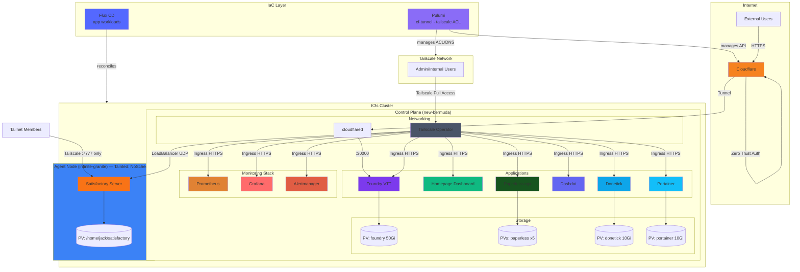

# Install & Setup Notes
## Ansible
- Seems to require `export ANSIBLE_BECOME_EXE=sudo.ws` due to [this issue](https://github.com/ansible/ansible/issues/85837)
- Run with `ansible-playbook playbook.yml -i inventory.yml -kK` where the flags have you manually input SSH password

# Repo Structure
- `ansible/` - Ansible playbook to bootstrap K3s cluster
- `pulumi/` - IaC for cloud API resources (Cloudflare tunnel, Tailscale ACL/settings)
- `flux/` - Flux CD manifests for all in-cluster K8s workloads

# Architecture Notes

## Diagram

## Networking
- **Cloudflare Tunnel**: Public access for Foundry VTT with Zero Trust email allowlist
- **Tailscale**: Private HTTPS access for all other services via Tailscale Ingress
  - ACL: admin user has full access; all other tailnet members restricted to Satisfactory (port 7777) only

## IaC Strategy
- **Pulumi** (`pulumi/`): Cloud API resources only — Cloudflare tunnel/DNS/Zero Trust, Tailscale ACL/MagicDNS/HTTPS settings
- **Flux CD** (`flux/`): All in-cluster K8s workloads — app deployments, services, ingresses, secrets (SOPS-encrypted), PVs/PVCs

# Resources / ideas
- [Awesome Selfhosting](https://github.com/awesome-selfhosted/awesome-selfhosted)
- [K8s selfhosting reddit thread](https://www.reddit.com/r/selfhosted/comments/85rj9d/kubernetes_anyone_use_this_for_their_home_systems/)
- [Maintaining containers for various self-hosted services on a single machine](https://www.reddit.com/r/selfhosted/comments/k3jwkd/maintaining_containers_for_various_selfhosted/)
- [Use Tailscale and CF Tunnel together](https://www.reddit.com/r/selfhosted/comments/1hocwqm/can_i_safely_use_cloudflare_tunnel_and_tailscale/)
