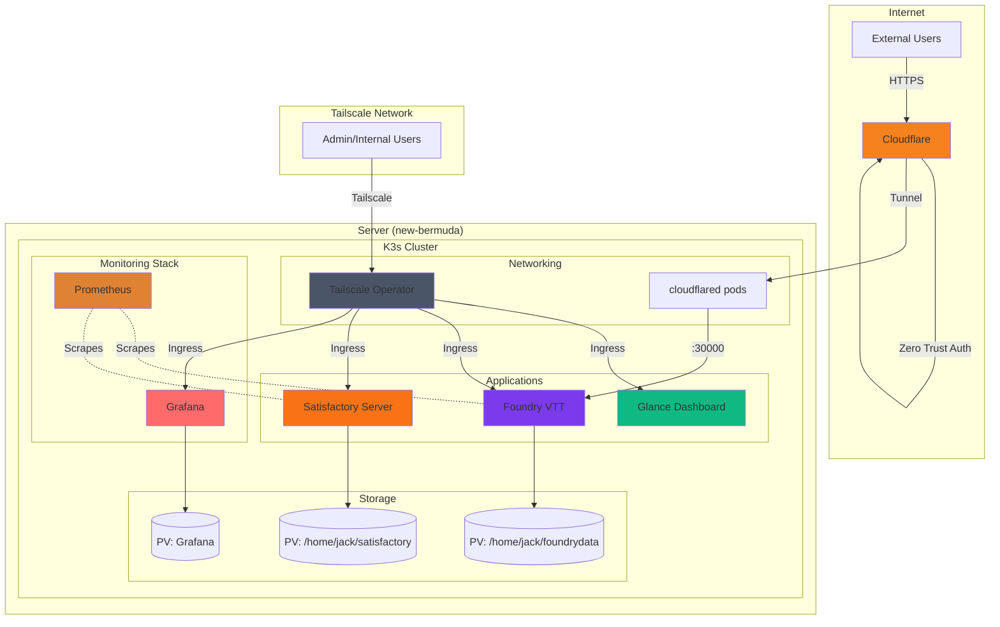

# Install & Setup Notes
## Ansible
- Seems to require `export ANSIBLE_BECOME_EXE=sudo.ws` due to [this issue](https://github.com/ansible/ansible/issues/85837)
- Run with `ansible-playbook playbook.yml -i inventory.yml -kK` where the flags have you manually input SSH password

# Repo Structure
- `ansible/` - Contains Ansible playbook to bootstrap K3s
- `pulumi` - IaC for managing cloud & k8s resources

# Architecture Notes

## Diagram

## Networking
- Cloudflare for 'application' access - in my case, Foundry for DnD sessions
- Tailscale for everything else
    - [Tailscale K8s operator pod](https://tailscale.com/kb/1236/kubernetes-operator#setup)

## Pulumi
- Used to manage Cloudflare resources
    - Creates tunnel & DNS records
    - Creates zero-trust application
- Also creates Kubernetes resources, generally a file per application
- Bootstrap K8s cluster basically
- NOTE: in the future, probably will get more Hardware
    - perhaps a stack per machine? maybe? that may not make sense though if a cluster is machine agnostic

# Resources / ideas
- [Awesome Selfhosting](https://github.com/awesome-selfhosted/awesome-selfhosted)
- [K8s selfhosting reddit thread](https://www.reddit.com/r/selfhosted/comments/85rj9d/kubernetes_anyone_use_this_for_their_home_systems/)
- [Maintaining containers for various self-hosted services on a single machine](https://www.reddit.com/r/selfhosted/comments/k3jwkd/maintaining_containers_for_various_selfhosted/)
- [Use Tailscale and CF Tunnel together](https://www.reddit.com/r/selfhosted/comments/1hocwqm/can_i_safely_use_cloudflare_tunnel_and_tailscale/)
