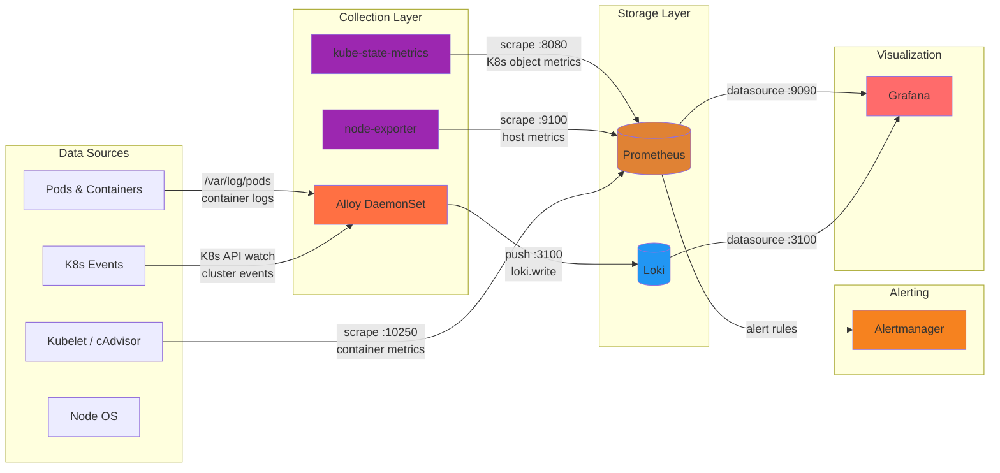

# Add Alloy + Loki to Monitoring Stack

> **For agentic workers:** REQUIRED SUB-SKILL: Use superpowers:subagent-driven-development (recommended) or superpowers:executing-plans to implement this plan task-by-task. Steps use checkbox (`- [ ]`) syntax for tracking.

**Goal:** Add Grafana Alloy (log collector) and Loki (log storage) to the existing monitoring stack, giving searchable pod logs and cluster events in Grafana alongside existing metrics.

**Architecture:** Alloy runs as a DaemonSet, tails pod logs from `/var/log`, enriches with K8s metadata, and ships to Loki. Loki runs in SingleBinary mode with filesystem storage on Longhorn. A Grafana datasource ConfigMap lets the existing sidecar auto-discover Loki. Existing kube-prometheus-stack and Grafana are untouched.

**Tech Stack:** Flux CD HelmReleases, `grafana/alloy` chart (v1.6.x), `grafana-community/loki` chart (v8.x), Kubernetes NetworkPolicies

---

## File Structure

| File | Action | Responsibility |
|------|--------|----------------|
| `flux/apps/_sources/helmrepos.yaml` | Modify | Add `grafana` HelmRepository for Alloy chart |
| `flux/apps/monitoring/loki.yaml` | Create | Loki HelmRelease (SingleBinary, filesystem, Longhorn PVC) |
| `flux/apps/monitoring/alloy.yaml` | Create | Alloy HelmRelease (DaemonSet, log pipeline config) |
| `flux/apps/monitoring/loki-datasource.yaml` | Create | ConfigMap for Grafana sidecar to auto-discover Loki datasource |
| `flux/apps/monitoring/networkpolicy.yaml` | Modify | Add Alloy and Loki network policies |
| `flux/apps/monitoring/kustomization.yaml` | Modify | Add new resources |
| `flux/apps/monitoring/README.md` | Create | In-depth monitoring stack explainer with diagram |
| `README.md` | Modify | Update architecture diagram |
| `CLAUDE.md` | Modify | Update Flux Apps table, storage, networking, recent changes |

---

### Task 1: Add Grafana HelmRepository

**Files:**
- Modify: `flux/apps/_sources/helmrepos.yaml:28-36` (append after grafana-community)

- [ ] **Step 1: Add the `grafana` HelmRepository**

Append to the end of `flux/apps/_sources/helmrepos.yaml`:

```yaml
---
apiVersion: source.toolkit.fluxcd.io/v1
kind: HelmRepository
metadata:
  name: grafana
  namespace: flux-system
spec:
  interval: 1h
  url: https://grafana.github.io/helm-charts
```

This is separate from the existing `grafana-community` repo (`https://grafana-community.github.io/helm-charts`). The Alloy chart is published to the official `grafana` repo.

- [ ] **Step 2: Commit**

```bash
git add flux/apps/_sources/helmrepos.yaml
git commit -m "feat: add grafana HelmRepository for Alloy chart"
```

---

### Task 2: Add Loki HelmRelease

**Files:**
- Create: `flux/apps/monitoring/loki.yaml`

- [ ] **Step 1: Create Loki HelmRelease**

Create `flux/apps/monitoring/loki.yaml`:

```yaml
apiVersion: helm.toolkit.fluxcd.io/v2
kind: HelmRelease
metadata:
  name: loki
  namespace: default
spec:
  interval: 1h
  chart:
    spec:
      chart: loki
      sourceRef:
        kind: HelmRepository
        name: grafana-community
        namespace: flux-system
  values:
    deploymentMode: SingleBinary
    singleBinary:
      replicas: 1
      persistence:
        enabled: true
        storageClass: longhorn
        size: 20Gi
    loki:
      storage:
        type: filesystem
      commonConfig:
        replication_factor: 1
      schemaConfig:
        configs:
          - from: "2024-01-01"
            store: tsdb
            object_store: filesystem
            schema: v13
            index:
              prefix: index_
              period: 24h
      limits_config:
        retention_period: 168h
      auth_enabled: false
    gateway:
      enabled: false
    chunksCache:
      enabled: false
    resultsCache:
      enabled: false
    backend:
      replicas: 0
    read:
      replicas: 0
    write:
      replicas: 0
    minio:
      enabled: false
```

Key decisions:
- `SingleBinary` mode — single pod, no distributed components (read/write/backend all set to 0 replicas)
- `filesystem` storage — no object storage (S3/MinIO) needed
- `longhorn` StorageClass — dynamic provisioning, consistent with Grafana PVC
- `gateway: false` — not needed for in-cluster access; Alloy talks directly to Loki on port 3100
- `auth_enabled: false` — no multi-tenancy needed
- `retention_period: 168h` (7 days) — keeps disk usage manageable on a single node
- Caches disabled — unnecessary overhead for single-binary mode

- [ ] **Step 2: Commit**

```bash
git add flux/apps/monitoring/loki.yaml
git commit -m "feat: add Loki HelmRelease (SingleBinary, filesystem, Longhorn)"
```

---

### Task 3: Add Loki Datasource ConfigMap

**Files:**
- Create: `flux/apps/monitoring/loki-datasource.yaml`

- [ ] **Step 1: Create datasource ConfigMap**

Create `flux/apps/monitoring/loki-datasource.yaml`:

```yaml
apiVersion: v1
kind: ConfigMap
metadata:
  name: loki-datasource
  namespace: default
  labels:
    grafana_datasource: "1"
data:
  loki-datasource.yaml: |
    apiVersion: 1
    datasources:
      - name: Loki
        type: loki
        access: proxy
        url: http://loki.default.svc.cluster.local:3100
        isDefault: false
        jsonData:
          maxLines: 1000
```

The `grafana_datasource: "1"` label is what the Grafana sidecar watches for. It will auto-discover this ConfigMap and add Loki as a datasource.

- [ ] **Step 2: Commit**

```bash
git add flux/apps/monitoring/loki-datasource.yaml
git commit -m "feat: add Loki datasource ConfigMap for Grafana sidecar"
```

---

### Task 4: Add Alloy HelmRelease

**Files:**
- Create: `flux/apps/monitoring/alloy.yaml`

- [ ] **Step 1: Create Alloy HelmRelease**

Create `flux/apps/monitoring/alloy.yaml`:

```yaml
apiVersion: helm.toolkit.fluxcd.io/v2
kind: HelmRelease
metadata:
  name: alloy
  namespace: default
spec:
  interval: 1h
  dependsOn:
    - name: loki
  chart:
    spec:
      chart: alloy
      sourceRef:
        kind: HelmRepository
        name: grafana
        namespace: flux-system
  values:
    alloy:
      mounts:
        varlog: true
      configMap:
        content: |
          // Discover all pods (single-node cluster, no node filtering needed)
          discovery.kubernetes "pods" {
            role = "pod"
          }

          // Relabel to extract useful metadata
          discovery.relabel "pods" {
            targets = discovery.kubernetes.pods.targets

            rule {
              source_labels = ["__meta_kubernetes_namespace"]
              target_label  = "namespace"
            }
            rule {
              source_labels = ["__meta_kubernetes_pod_name"]
              target_label  = "pod"
            }
            rule {
              source_labels = ["__meta_kubernetes_pod_container_name"]
              target_label  = "container"
            }
            rule {
              source_labels = ["__meta_kubernetes_namespace", "__meta_kubernetes_pod_name"]
              separator     = "/"
              target_label  = "job"
            }
          }

          // Tail pod logs from /var/log/pods
          loki.source.kubernetes "pods" {
            targets    = discovery.relabel.pods.output
            forward_to = [loki.write.local.receiver]
          }

          // Collect Kubernetes events
          loki.source.kubernetes_events "events" {
            forward_to = [loki.write.local.receiver]
          }

          // Ship to Loki
          loki.write "local" {
            endpoint {
              url = "http://loki.default.svc.cluster.local:3100/loki/api/v1/push"
            }
          }
```

Key decisions:
- `mounts.varlog: true` — mounts `/var/log` from the host so Alloy can tail pod logs
- DaemonSet is the default controller type — runs one Alloy pod per node (just one pod on single-node cluster)
- No node field selector — single-node cluster, all pods are on the same node
- `dependsOn: loki` — ensures Loki is ready before Alloy starts pushing logs
- Pipeline: discover pods → relabel with namespace/pod/container → tail logs → push to Loki
- Also collects Kubernetes events via `loki.source.kubernetes_events`
- No metrics collection — that's already handled by kube-prometheus-stack

- [ ] **Step 2: Commit**

```bash
git add flux/apps/monitoring/alloy.yaml
git commit -m "feat: add Alloy HelmRelease (DaemonSet log collector → Loki)"
```

---

### Task 5: Update Network Policies

**Files:**
- Modify: `flux/apps/monitoring/networkpolicy.yaml`

- [ ] **Step 1: Add Loki network policy**

Append to `flux/apps/monitoring/networkpolicy.yaml`:

```yaml
---
apiVersion: networking.k8s.io/v1
kind: NetworkPolicy
metadata:
  name: loki
  namespace: default
spec:
  podSelector:
    matchLabels:
      app.kubernetes.io/name: loki
  policyTypes:
    - Ingress
    - Egress
  ingress:
    # Alloy pushing logs
    - from:
        - podSelector:
            matchLabels:
              app.kubernetes.io/name: alloy
      ports:
        - port: 3100
          protocol: TCP
    # Grafana querying logs
    - from:
        - podSelector:
            matchLabels:
              app.kubernetes.io/name: grafana
      ports:
        - port: 3100
          protocol: TCP
  egress:
    # DNS
    - to:
        - namespaceSelector:
            matchLabels:
              kubernetes.io/metadata.name: kube-system
          podSelector:
            matchLabels:
              k8s-app: kube-dns
      ports:
        - port: 53
          protocol: UDP
        - port: 53
          protocol: TCP
```

Loki only needs:
- Ingress from Alloy (log push) and Grafana (log queries) on port 3100
- Egress to DNS only (filesystem storage, no external calls)

- [ ] **Step 2: Add Alloy network policy**

Append to `flux/apps/monitoring/networkpolicy.yaml`:

```yaml
---
apiVersion: networking.k8s.io/v1
kind: NetworkPolicy
metadata:
  name: alloy
  namespace: default
spec:
  podSelector:
    matchLabels:
      app.kubernetes.io/name: alloy
  policyTypes:
    - Ingress
    - Egress
  ingress: []
  egress:
    # DNS
    - to:
        - namespaceSelector:
            matchLabels:
              kubernetes.io/metadata.name: kube-system
          podSelector:
            matchLabels:
              k8s-app: kube-dns
      ports:
        - port: 53
          protocol: UDP
        - port: 53
          protocol: TCP
    # Kubernetes API (for pod discovery and events)
    - to:
        - ipBlock:
            cidr: 10.43.0.1/32
        - ipBlock:
            cidr: 192.168.1.9/32
      ports:
        - port: 443
          protocol: TCP
        - port: 6443
          protocol: TCP
    # Loki (log push)
    - to:
        - podSelector:
            matchLabels:
              app.kubernetes.io/name: loki
      ports:
        - port: 3100
          protocol: TCP
```

Alloy needs:
- No ingress (it pulls logs from host filesystem, pushes to Loki)
- Egress to DNS, K8s API (pod discovery + events), and Loki (log push)

- [ ] **Step 3: Update Grafana network policy to allow Loki egress**

Add a new egress rule to the existing `grafana` NetworkPolicy in `flux/apps/monitoring/networkpolicy.yaml`, after the Prometheus egress block:

```yaml
    # Loki (log queries)
    - to:
        - podSelector:
            matchLabels:
              app.kubernetes.io/name: loki
      ports:
        - port: 3100
          protocol: TCP
```

- [ ] **Step 4: Commit**

```bash
git add flux/apps/monitoring/networkpolicy.yaml
git commit -m "feat: add Alloy and Loki network policies, allow Grafana→Loki egress"
```

---

### Task 6: Update Kustomization

**Files:**
- Modify: `flux/apps/monitoring/kustomization.yaml`

- [ ] **Step 1: Add new resources**

Update `flux/apps/monitoring/kustomization.yaml` to:

```yaml
apiVersion: kustomize.config.k8s.io/v1beta1
kind: Kustomization
resources:
  - grafana.yaml
  - kube-prometheus-stack.yaml
  - loki.yaml
  - loki-datasource.yaml
  - alloy.yaml
  - networkpolicy.yaml
```

- [ ] **Step 2: Commit**

```bash
git add flux/apps/monitoring/kustomization.yaml
git commit -m "feat: add Loki, Alloy, and datasource to monitoring kustomization"
```

---

### Task 7: Update README Architecture Diagram

**Files:**
- Modify: `README.md:46-49` (Monitoring subgraph)

- [ ] **Step 1: Update the Monitoring subgraph**

Replace the Monitoring subgraph in `README.md` (lines 46-49):

```mermaid
            subgraph Monitoring[Monitoring Stack]
                KPS[kube-prometheus-stack\nPrometheus · Alertmanager\nkube-state-metrics · node-exporter]
                Grafana[Grafana]
            end
```

with:

```mermaid
            subgraph Monitoring[Monitoring Stack]
                KPS[kube-prometheus-stack\nPrometheus · Alertmanager\nkube-state-metrics · node-exporter]
                Alloy[Alloy\nlog collector]
                Loki[Loki\nlog storage]
                Grafana[Grafana]
            end
```

- [ ] **Step 2: Add data flow edges**

After the existing `KPS -->|datasources/dashboards via sidecar| Grafana` line (line 75), add:

```
    Alloy -->|push logs| Loki
    Loki -->|datasource via sidecar| Grafana
```

- [ ] **Step 3: Add styles for new components**

After the existing style lines, add:

```
    style Alloy fill:#ff7043
    style Loki fill:#2196f3
```

- [ ] **Step 4: Add Loki storage PV**

In the Storage subgraph (around line 52-57), add:

```
                LokiPV[(PVC: loki 20Gi Longhorn)]
```

And add the storage edge after the existing ones:

```
    Loki --> LokiPV
```

- [ ] **Step 5: Commit**

```bash
git add README.md
git commit -m "docs: update architecture diagram with Alloy and Loki"
```

---

### Task 8: Update CLAUDE.md

**Files:**
- Modify: `CLAUDE.md`

- [ ] **Step 1: Update Flux Apps table**

Add two rows to the Flux Apps table (after the `kube-prometheus-stack` row at line 124):

```
| alloy | HelmRelease | — | grafana/alloy, DaemonSet log collector → Loki |
| loki | HelmRelease | — | grafana-community/loki, SingleBinary, filesystem storage, 7-day retention |
```

- [ ] **Step 2: Update Storage table**

Add to the storage table (after Grafana row, line 168):

```
| Loki | 20Gi | Longhorn (dynamic) |
```

- [ ] **Step 3: Update Networking section**

In the Tailscale services list (line 178-179), update:

```
- Prometheus/Alertmanager: internal only (bundled in kube-prometheus-stack, no Tailscale ingress)
```

to:

```
- Prometheus/Alertmanager: internal only (bundled in kube-prometheus-stack, no Tailscale ingress)
- Loki: internal only (log storage, no Tailscale ingress)
```

- [ ] **Step 4: Update Recent Architecture Changes**

Add a new bullet to the Recent Architecture Changes section:

```
- **Alloy + Loki Added**: Grafana Alloy (DaemonSet) collects pod logs and K8s events, ships to Loki (SingleBinary, filesystem, Longhorn). Grafana auto-discovers Loki datasource via sidecar ConfigMap. See `flux/apps/monitoring/README.md` for monitoring stack details.
```

- [ ] **Step 5: Commit**

```bash
git add CLAUDE.md
git commit -m "docs: update CLAUDE.md with Alloy and Loki details"
```

---

### Task 9: Write Monitoring Stack README

**Files:**
- Create: `flux/apps/monitoring/README.md`

- [ ] **Step 1: Create the monitoring stack README**

Create `flux/apps/monitoring/README.md` with the following content:

````markdown
# Monitoring Stack

This directory contains the full observability stack for the K3s cluster. It provides metrics, logs, alerting, and dashboards — all accessible through Grafana.

## Architecture Diagram



## Components

### What Each Component Does

| Component | Chart | What It Does |
|-----------|-------|-------------|
| **Prometheus** | `kube-prometheus-stack` | Time-series database for metrics. Scrapes numeric data (CPU %, memory bytes, request counts) from endpoints at regular intervals and stores it. You query it with PromQL. |
| **Alertmanager** | `kube-prometheus-stack` | Receives alerts from Prometheus when metric thresholds are crossed (e.g., "disk > 90%"). Routes/deduplicates/silences alerts. Currently no receivers configured (alerts visible in Alertmanager UI only). |
| **kube-state-metrics** | `kube-prometheus-stack` | Exposes Kubernetes object state as Prometheus metrics — pod status, deployment replicas, node conditions, PVC usage. Answers "how many pods are in CrashLoopBackOff?" |
| **node-exporter** | `kube-prometheus-stack` | Exposes host-level OS metrics — CPU, memory, disk, network. Answers "how much disk space is left on new-bermuda?" |
| **Grafana** | `grafana` (standalone) | Dashboard UI. Connects to Prometheus and Loki as datasources. Sidecars auto-discover dashboards and datasources from ConfigMaps labeled `grafana_dashboard: "1"` or `grafana_datasource: "1"`. |
| **Alloy** | `alloy` (standalone) | Log collector. Runs as a DaemonSet (one pod per node), tails container logs from `/var/log/pods`, enriches with K8s metadata (namespace, pod, container), and pushes to Loki. Also watches K8s events. |
| **Loki** | `loki` (standalone) | Log storage engine (like Prometheus, but for logs). Stores log lines indexed by labels. You query it with LogQL in Grafana. Runs in SingleBinary mode with filesystem storage. |

### Data Flow

There are two independent pipelines:

**Metrics pipeline** (numbers over time):
1. **kube-state-metrics** and **node-exporter** expose `/metrics` HTTP endpoints
2. **Prometheus** scrapes these endpoints every 15-30 seconds
3. Prometheus stores the time-series data and evaluates alert rules
4. **Grafana** queries Prometheus via PromQL to render dashboards

**Logs pipeline** (text lines):
1. Containers write to stdout/stderr → K3s writes to `/var/log/pods/` on the node
2. **Alloy** tails those files, adds labels (namespace, pod, container)
3. Alloy pushes log batches to **Loki** via HTTP
4. **Grafana** queries Loki via LogQL to search/filter logs

### What's Prometheus Operator?

`kube-prometheus-stack` includes the **Prometheus Operator**, which extends K8s with custom resources:
- `ServiceMonitor` — tells Prometheus "scrape this service's metrics endpoint"
- `PodMonitor` — tells Prometheus "scrape this pod's metrics endpoint"
- `PrometheusRule` — defines alerting/recording rules
- `Prometheus` — defines the Prometheus server itself

The operator watches for these resources and auto-configures Prometheus. The chart ships pre-configured ServiceMonitors for kubelet, kube-state-metrics, node-exporter, and K8s API server.

## Querying in Grafana

### PromQL (metrics)

```promql
# CPU usage by pod (last 5 minutes)
rate(container_cpu_usage_seconds_total{namespace="default"}[5m])

# Memory usage by pod
container_memory_working_set_bytes{namespace="default"}

# Disk usage on node
1 - node_filesystem_avail_bytes{mountpoint="/"} / node_filesystem_size_bytes{mountpoint="/"}

# Pod restart count
kube_pod_container_status_restarts_total{namespace="default"}
```

### LogQL (logs)

```logql
# All logs from a specific pod
{pod="foundry-abc123"}

# Errors in the default namespace
{namespace="default"} |= "error"

# Logs from foundry, excluding healthchecks
{pod=~"foundry.*"} != "GET /health"

# K8s events (warnings only)
{job="integrations/kubernetes/eventhandler"} |= "Warning"
```

## Network Policies

Each monitoring component has a dedicated NetworkPolicy:

| Component | Ingress From | Egress To |
|-----------|-------------|-----------|
| **Grafana** | Tailscale (port 3000) | DNS, K8s API, Prometheus (9090), Loki (3100), Internet (443 for plugins) |
| **Loki** | Alloy (3100), Grafana (3100) | DNS |
| **Alloy** | (none) | DNS, K8s API (443/6443), Loki (3100) |
| **Prometheus** | Grafana (9090) | Managed by kube-prometheus-stack |
| **kube-state-metrics** | Prometheus (8080) | Managed by kube-prometheus-stack |
| **node-exporter** | Prometheus (9100) | Managed by kube-prometheus-stack |

## Storage

| Component | Size | Type | Retention |
|-----------|------|------|-----------|
| Grafana | 10Gi | Longhorn | — (dashboards/config) |
| Loki | 20Gi | Longhorn | 7 days |
| Prometheus | default | Longhorn | 15 days (kube-prometheus-stack default) |

## Files in This Directory

| File | Purpose |
|------|---------|
| `kube-prometheus-stack.yaml` | HelmRelease: Prometheus Operator, Prometheus, Alertmanager, kube-state-metrics, node-exporter |
| `grafana.yaml` | HelmRelease: Standalone Grafana with sidecar auto-discovery |
| `loki.yaml` | HelmRelease: Loki log storage (SingleBinary, filesystem) |
| `loki-datasource.yaml` | ConfigMap: Tells Grafana sidecar to add Loki as a datasource |
| `alloy.yaml` | HelmRelease: Alloy log collector (DaemonSet) |
| `networkpolicy.yaml` | NetworkPolicies for Grafana, Loki, and Alloy |
````

- [ ] **Step 2: Commit**

```bash
git add flux/apps/monitoring/README.md
git commit -m "docs: add monitoring stack README with architecture diagram and component breakdown"
```

---

### Task 10: Verification

- [ ] **Step 1: Verify all files exist and are valid YAML**

```bash
# Check all monitoring files exist
ls -la flux/apps/monitoring/

# Validate YAML syntax (requires yq or python)
python3 -c "
import yaml, sys, glob
for f in glob.glob('flux/apps/monitoring/*.yaml'):
    try:
        list(yaml.safe_load_all(open(f)))
        print(f'OK: {f}')
    except Exception as e:
        print(f'FAIL: {f}: {e}')
        sys.exit(1)
"
```

Expected: All files OK.

- [ ] **Step 2: Verify kustomization includes all resources**

```bash
grep -c "\.yaml" flux/apps/monitoring/kustomization.yaml
```

Expected: 6 (grafana, kube-prometheus-stack, loki, loki-datasource, alloy, networkpolicy)

- [ ] **Step 3: Verify HelmRepository references are correct**

```bash
# Alloy should reference 'grafana' repo
grep -A3 "sourceRef" flux/apps/monitoring/alloy.yaml

# Loki should reference 'grafana-community' repo
grep -A3 "sourceRef" flux/apps/monitoring/loki.yaml

# Both repos should exist in helmrepos.yaml
grep "name:" flux/apps/_sources/helmrepos.yaml
```

- [ ] **Step 4: Verify network policies cover all new components**

```bash
grep "name:" flux/apps/monitoring/networkpolicy.yaml | head -20
```

Expected: `grafana`, `loki`, `alloy` NetworkPolicies present.
