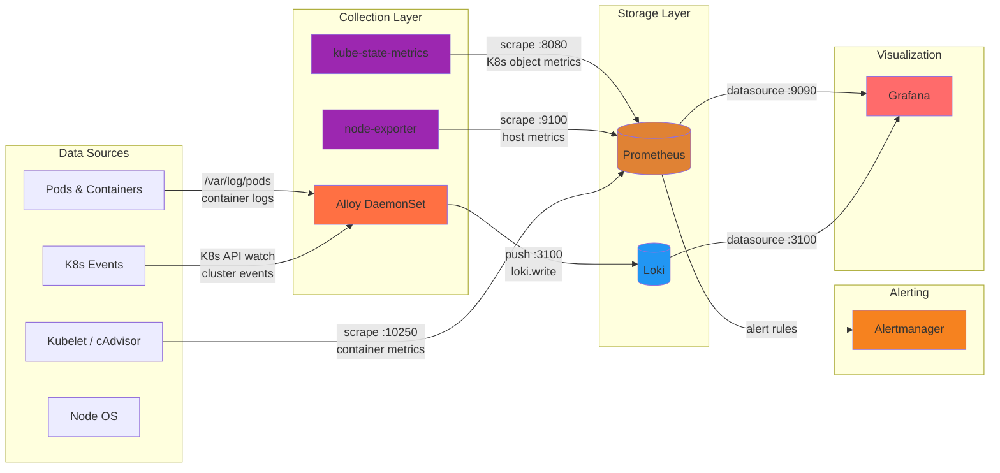

# Monitoring Stack

This directory contains the full observability stack for the K3s cluster. It provides metrics, logs, alerting, and dashboards — all accessible through Grafana.

## Architecture Diagram



## Components

### What Each Component Does

| Component | Chart | What It Does |
|-----------|-------|-------------|
| **Prometheus** | `kube-prometheus-stack` | Time-series database for metrics. Scrapes numeric data (CPU %, memory bytes, request counts) from endpoints at regular intervals and stores it. You query it with PromQL. |
| **Alertmanager** | `kube-prometheus-stack` | Receives alerts from Prometheus when metric thresholds are crossed (e.g., "disk > 90%"). Routes/deduplicates/silences alerts. Currently no receivers configured (alerts visible in Alertmanager UI only). |
| **kube-state-metrics** | `kube-prometheus-stack` | Exposes Kubernetes object state as Prometheus metrics — pod status, deployment replicas, node conditions, PVC usage. Answers "how many pods are in CrashLoopBackOff?" |
| **node-exporter** | `kube-prometheus-stack` | Exposes host-level OS metrics — CPU, memory, disk, network. Answers "how much disk space is left on new-bermuda?" |
| **Grafana** | `grafana` (standalone) | Dashboard UI. Connects to Prometheus and Loki as datasources. Sidecars auto-discover dashboards and datasources from ConfigMaps labeled `grafana_dashboard: "1"` or `grafana_datasource: "1"`. |
| **Alloy** | `alloy` (standalone) | Log collector. Runs as a DaemonSet (one pod per node), tails container logs from `/var/log/pods`, enriches with K8s metadata (namespace, pod, container), and pushes to Loki. Also watches K8s events. |
| **Loki** | `loki` (standalone) | Log storage engine (like Prometheus, but for logs). Stores log lines indexed by labels. You query it with LogQL in Grafana. Runs in SingleBinary mode with filesystem storage. |

### Data Flow

There are two independent pipelines:

**Metrics pipeline** (numbers over time):
1. **kube-state-metrics** and **node-exporter** expose `/metrics` HTTP endpoints
2. **Prometheus** scrapes these endpoints every 15-30 seconds
3. Prometheus stores the time-series data and evaluates alert rules
4. **Grafana** queries Prometheus via PromQL to render dashboards

**Logs pipeline** (text lines):
1. Containers write to stdout/stderr → K3s writes to `/var/log/pods/` on the node
2. **Alloy** tails those files, adds labels (namespace, pod, container)
3. Alloy pushes log batches to **Loki** via HTTP
4. **Grafana** queries Loki via LogQL to search/filter logs

### What's Prometheus Operator?

`kube-prometheus-stack` includes the **Prometheus Operator**, which extends K8s with custom resources:
- `ServiceMonitor` — tells Prometheus "scrape this service's metrics endpoint"
- `PodMonitor` — tells Prometheus "scrape this pod's metrics endpoint"
- `PrometheusRule` — defines alerting/recording rules
- `Prometheus` — defines the Prometheus server itself

The operator watches for these resources and auto-configures Prometheus. The chart ships pre-configured ServiceMonitors for kubelet, kube-state-metrics, node-exporter, and K8s API server.

## Querying in Grafana

### PromQL (metrics)

```promql
# CPU usage by pod (last 5 minutes)
rate(container_cpu_usage_seconds_total{namespace="default"}[5m])

# Memory usage by pod
container_memory_working_set_bytes{namespace="default"}

# Disk usage on node
1 - node_filesystem_avail_bytes{mountpoint="/"} / node_filesystem_size_bytes{mountpoint="/"}

# Pod restart count
kube_pod_container_status_restarts_total{namespace="default"}
```

### LogQL (logs)

```logql
# All logs from a specific pod
{pod="foundry-abc123"}

# Errors in the default namespace
{namespace="default"} |= "error"

# Logs from foundry, excluding healthchecks
{pod=~"foundry.*"} != "GET /health"

# K8s events (warnings only)
{job="integrations/kubernetes/eventhandler"} |= "Warning"
```

## Network Policies

Each monitoring component has a dedicated NetworkPolicy:

| Component | Ingress From | Egress To |
|-----------|-------------|-----------|
| **Grafana** | Tailscale (port 3000) | DNS, K8s API, Prometheus (9090), Loki (3100), Internet (443 for plugins) |
| **Loki** | Alloy (3100), Grafana (3100) | DNS |
| **Alloy** | (none) | DNS, K8s API (443/6443), Loki (3100) |
| **Prometheus** | Grafana (9090) | Managed by kube-prometheus-stack |
| **kube-state-metrics** | Prometheus (8080) | Managed by kube-prometheus-stack |
| **node-exporter** | Prometheus (9100) | Managed by kube-prometheus-stack |

## Storage

| Component | Size | Type | Retention |
|-----------|------|------|-----------|
| Grafana | 10Gi | Longhorn | — (dashboards/config) |
| Loki | 20Gi | Longhorn | 7 days |
| Prometheus | default | Longhorn | 15 days (kube-prometheus-stack default) |

## Files in This Directory

| File | Purpose |
|------|---------|
| `kube-prometheus-stack.yaml` | HelmRelease: Prometheus Operator, Prometheus, Alertmanager, kube-state-metrics, node-exporter |
| `grafana.yaml` | HelmRelease: Standalone Grafana with sidecar auto-discovery |
| `loki.yaml` | HelmRelease: Loki log storage (SingleBinary, filesystem) |
| `loki-datasource.yaml` | ConfigMap: Tells Grafana sidecar to add Loki as a datasource |
| `alloy.yaml` | HelmRelease: Alloy log collector (DaemonSet) |
| `networkpolicy.yaml` | NetworkPolicies for Grafana, Loki, and Alloy |
