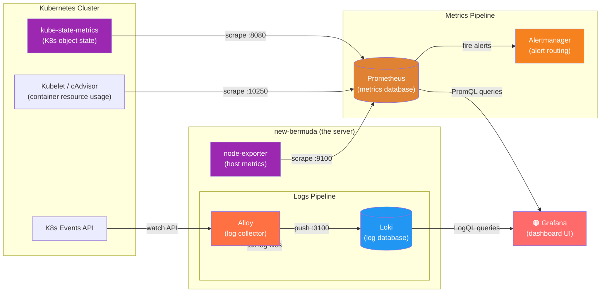

# Monitoring Stack

This directory contains the full observability stack for the K3s cluster. It answers two questions:

- **"What are the numbers doing?"** — metrics (CPU, memory, disk, etc.)
- **"What did the logs say?"** — log lines from every container

Everything is visible through **Grafana**, which is the only UI you ever need to open.

## Architecture Diagram



## What Each Component Does

### Grafana
The dashboard UI — the only thing you interact with directly. It doesn't store anything itself; it just queries Prometheus and Loki and draws charts. Accessible at `grafana.pipefish-manta.ts.net`.

Grafana auto-discovers its datasources and dashboards from Kubernetes ConfigMaps (via a sidecar container). Any ConfigMap labeled `grafana_datasource: "1"` or `grafana_dashboard: "1"` gets picked up automatically — no manual config needed.

---

### Prometheus
A time-series database for **numbers**. It works by *scraping* — every 15–30 seconds it sends an HTTP request to each metrics endpoint, gets back a list of numbers, and stores them with a timestamp. Over time this builds up a history you can graph.

You query it with **PromQL**, a query language designed for time-series math (rates, averages, ratios, etc.).

Prometheus is managed by the **Prometheus Operator** (bundled in `kube-prometheus-stack`). The operator lets you define scrape targets using Kubernetes resources called `ServiceMonitor`s, instead of editing config files manually.

---

### kube-state-metrics
Kubernetes knows a lot about itself — how many pods are running, whether a deployment has the right number of replicas, which nodes are ready. But it doesn't expose that as Prometheus metrics by default. kube-state-metrics bridges that gap: it watches the Kubernetes API and turns that state into a `/metrics` endpoint that Prometheus can scrape.

Example metrics it provides:
- `kube_pod_status_phase` — is each pod Running/Pending/Failed?
- `kube_deployment_status_replicas_available` — how many replicas are actually up?
- `kube_persistentvolumeclaim_status_phase` — are PVCs bound?

---

### node-exporter
Exposes **host OS metrics** from the server itself — CPU usage, memory, disk space, network throughput, etc. It runs as a DaemonSet (one pod per node) with `hostNetwork: true`, meaning it uses the server's real network interface rather than a virtual pod IP. This is necessary so it can see and report on the real hardware.

Example metrics:
- `node_cpu_seconds_total` — CPU time by mode (idle, user, system)
- `node_filesystem_avail_bytes` — free disk space per mount
- `node_memory_MemAvailable_bytes` — available RAM

This is what powers the [Node Exporter Full dashboard (ID 1860)](https://grafana.com/grafana/dashboards/1860).

> **Note:** node-exporter is configured with `--collector.systemd` and `--collector.processes` to expose systemd service status and per-process metrics, which some dashboard panels require.

---

### Alertmanager
Receives alerts from Prometheus when rules are triggered (e.g. "disk usage > 90% for 5 minutes") and handles routing, deduplication, and silencing. Currently no notification receivers are configured, so alerts are visible in the Alertmanager UI only.

---

### Alloy
A log collector that runs as a DaemonSet. It:
1. Tails container log files from `/var/log/pods/` on the node
2. Enriches each log line with Kubernetes metadata (namespace, pod name, container name)
3. Watches the Kubernetes Events API for cluster events
4. Pushes everything to Loki

---

### Loki
A log storage engine — like Prometheus, but for **text**. It stores log lines indexed by labels (namespace, pod, container, etc.). You query it with **LogQL** in Grafana's Explore view or in dashboard panels. Runs in SingleBinary mode (single pod) with data stored on a 20Gi Longhorn volume, with 7-day retention.

---

## The Two Pipelines

### Metrics pipeline (numbers)
```
node-exporter ──┐
kube-state-metrics ──┼──► Prometheus ──► Grafana dashboards
kubelet/cAdvisor ──┘         │
                              └──► Alertmanager
```

### Logs pipeline (text)
```
container stdout/stderr ──► /var/log/pods/ ──┐
                                               ├──► Alloy ──► Loki ──► Grafana Explore
K8s Events API ────────────────────────────────┘
```

---

## Querying in Grafana

### PromQL (metrics)

Open **Explore → Prometheus** to run ad-hoc queries.

```promql
# CPU usage % across all pods (last 5 minutes)
rate(container_cpu_usage_seconds_total{namespace="default"}[5m])

# Free disk space on the node
node_filesystem_avail_bytes{mountpoint="/"}

# Pod restart counts
kube_pod_container_status_restarts_total{namespace="default"}

# Is a specific pod running?
kube_pod_status_phase{pod="foundry", phase="Running"}
```

### LogQL (logs)

Open **Explore → Loki** to search logs.

```logql
# All logs from the foundry pod
{pod=~"foundry.*"}

# Errors across the whole default namespace
{namespace="default"} |= "error"

# K8s events (warnings only)
{job="integrations/kubernetes/eventhandler"} |= "Warning"

# Logs from foundry, excluding noisy health checks
{pod=~"foundry.*"} != "GET /health"
```

---

## Network Policies

Each component has an explicit NetworkPolicy. The cluster uses default-deny, so only the connections listed below are permitted.

| Component | Accepts traffic from | Sends traffic to |
|-----------|---------------------|-----------------|
| **Grafana** | Tailscale (port 3000) | DNS, K8s API, Prometheus :9090, Loki :3100, internet :443 |
| **Prometheus** | Grafana (port 9090) | DNS, K8s API, node-exporter :9100 (host IP), kube-state-metrics :8080, alertmanager :9093 |
| **Loki** | Alloy :3100, Grafana :3100 | DNS |
| **Alloy** | — | DNS, K8s API :443/:6443, Loki :3100 |

> **Why does Prometheus have a special rule for node-exporter?** node-exporter uses `hostNetwork: true` so it binds to the real server IP (`192.168.1.9`) rather than a pod overlay IP. A normal `podSelector` rule wouldn't cover it, so there's an explicit `ipBlock` rule for that IP on port 9100.

---

## Storage

| Component | Size | Type | Retention |
|-----------|------|------|-----------|
| Grafana | 10Gi | Longhorn | — (dashboards/config) |
| Loki | 20Gi | Longhorn | 7 days |
| Prometheus | 10Gi | Longhorn | 15 days (default) |

---

## Files in This Directory

| File | Purpose |
|------|---------|
| `kube-prometheus-stack.yaml` | HelmRelease: Prometheus Operator, Prometheus, Alertmanager, kube-state-metrics, node-exporter |
| `grafana.yaml` | HelmRelease: Grafana with sidecar auto-discovery for dashboards/datasources |
| `loki.yaml` | HelmRelease: Loki log storage (SingleBinary, filesystem, Longhorn) |
| `loki-datasource.yaml` | ConfigMap: Grafana sidecar picks this up to add Loki as a datasource |
| `prometheus-datasource.yaml` | ConfigMap: Grafana sidecar picks this up to add Prometheus as a datasource |
| `alloy.yaml` | HelmRelease: Alloy log collector DaemonSet |
| `networkpolicy.yaml` | NetworkPolicies for Grafana, Prometheus, Loki, and Alloy |
